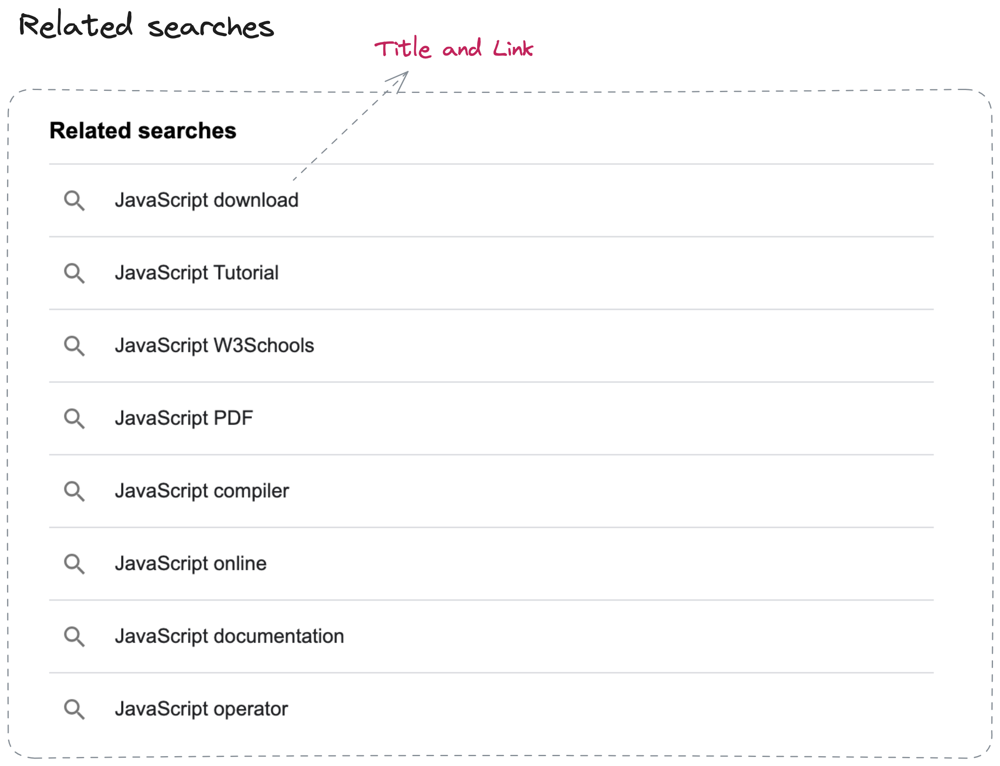

# Google SERP Anatomy

## Anatomy

#### Organic Results

### Ads Results

### Knowledge Graph

### Places

### People Also Ask

### Related Searches

### Spell Check

### Top Stories

### Twitter Results

### Inline Images

### Songs

### Albums

## Ref
- https://weareroast.com/resource/navigating-the-search-landscape/
- https://moz.com/learn/seo/serp-features